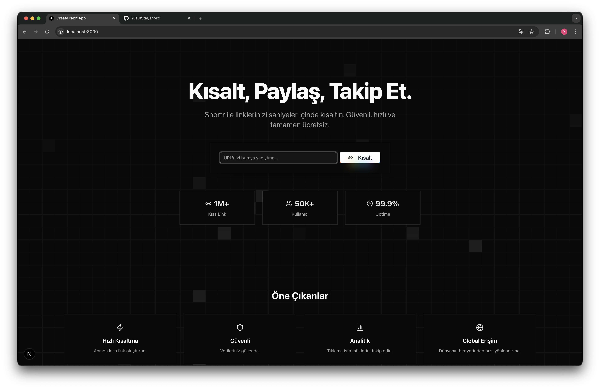

# Shortr



Shortr is an open-source URL shortening platform. You can easily create your own short links, share them, and track click statistics. With its modern interface and powerful features, it is a professional project that can take place in your portfolio.

## Features

- 🚀 **Fast Shortening:** Instantly create short links
- 🔒 **Secure:** Your data is safe
- 📊 **Analytics:** Track click statistics
- 🌍 **Global Access:** Fast redirection from anywhere
- 🆓 **Free:** Completely free to use

## Installation

1. **Clone the project:**
   ```bash
   git clone https://github.com/kullaniciadi/shortr.git
   cd shortr
   ```
2. **Install dependencies:**
   ```bash
   bun install
   # or
   npm install
   ```
3. **Set up environment variables:**
   Create a `.env` file and enter the required keys (see `.env.example` for reference).
4. **Set up the database:**
   ```bash
   bunx prisma migrate dev
   # or
   npx prisma migrate dev
   ```
5. **Generate Prisma Client:**
   ```bash
   bunx prisma generate
   # or
   npx prisma generate
   ```
6. **Start the development server:**
   ```bash
   bun run dev
   # or
   npm run dev
   ```

## Technologies Used

- Next.js
- React
- Prisma ORM
- Clerk (authentication)
- Tailwind CSS
- Bun (optional, also works with Node.js)

## Contributing

Contributions are welcome! Please open an issue or submit a pull request.

## License

MIT

---

> This project was developed for portfolio purposes. I am open to any feedback.
